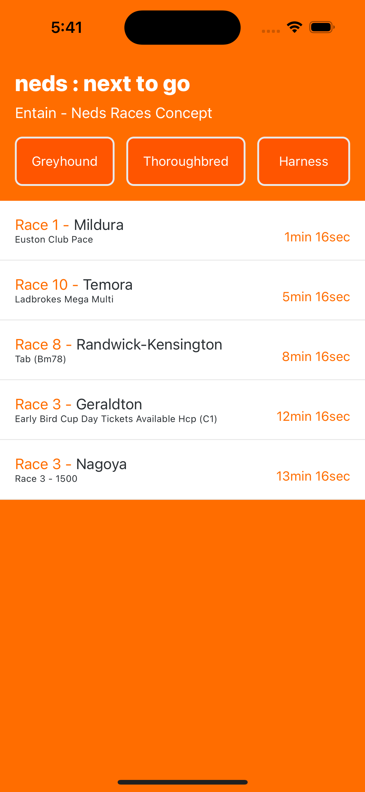

This is a new proof of concept project, bootstrapped using [`@react-native-community/cli`](https://github.com/react-native-community/cli).

# Next To Go - Single Page App

## What does it do?

A demonstration of how I may tackle orchestrating an application, utilizing concepts such as separation of concerns, memoization, and state management. 

`Redux-ToolKit` is used to manage the state of the application.

No styling libraries are used, although a fan of `styled-components`, this didn't seem necessary in this instance.

The timer logic is handle in the ListContainer to centralize the logic for the filtering of the filtered items, as this seems more performant than implementing the timer on each instance of the ListItem.

## Data
The API is fetched upon the application loading, and the data is stored in the redux store. This data is filtered on category choice and start time.

## Show me

```bash
yarn start
```

Launch via Xcode or Android Studio or
```bash
yarn ios 
yarn android
```



## Running Tests?

```
yarn test
```


## Troubleshooting

Contact info@deprogram.io for any issues.
